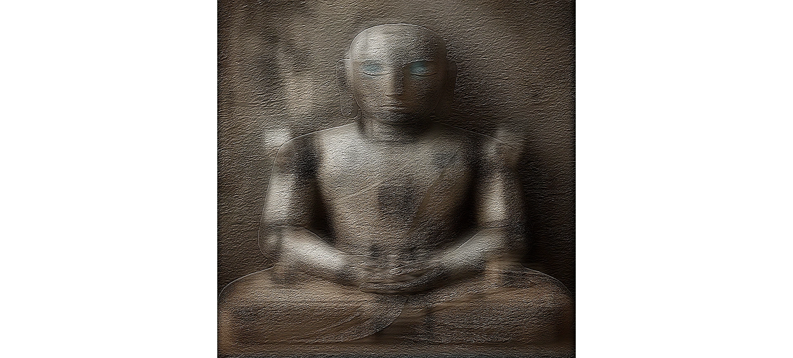

以高通及低通創造遠近不同的觀看方式。正常觀看下是看到佛陀石像，象徵人類內在的精神、信仰與平靜，遠看或瞇上眼時會慢慢看到那個形象其實是一個機器人，會慢慢看到那個形象其實是一個機器人我想。讓這兩個看似對立的意象重疊在一起，就像在AI時代裡，機器慢慢被人類賦予情感與力量，甚至成為新的信仰對象。

整體畫面在質地上也試著做出「柔與硬」的落差，石像的部分比較溫潤、帶著時間的痕跡，而機器人的線條則透過高通濾鏡突顯出冰冷的質感。
這樣的對比，對我來說像是一種提問：當我們越依賴科技，信仰的形狀會變成什麼？

